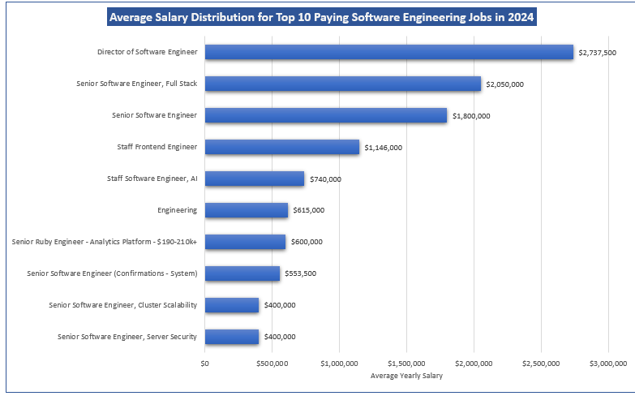
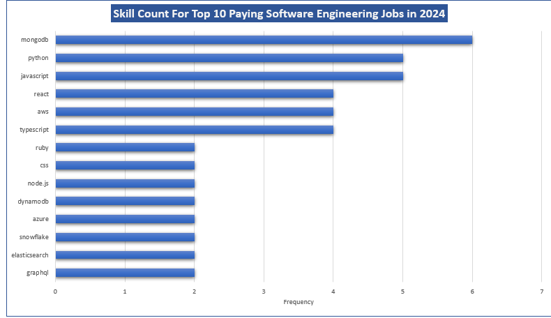

# Data_Jobs_Project
 # 🚀Introduction
 Explored the software engineering job market! This project delves into 💰 top-paying roles, 🔥 essential in-demand skills, and 📈 the intersection of high demand and high salaries in the software engineering field.
 # 📖Background
 Motivated by **a goal to help a friend better navigate the software engineering job market**, this project emerged from a need to identify top-paying roles and in-demand skills, simplifying the process for others to find the most rewarding opportunities in the field.
 
 Data hails from [Luke Barousse SQL course](https://lukebarousse.com/sql). It's packed with insights on job titles, salaries, location, and essential skills.

 1. What are the top-paying software engineering jobs?

2. What skills are required for these top-paying software engineering roles?

3. What skills are most in demand for software engineers?

4. Which skills are linked to higher salaries in software engineering?

5. What are the most optimal skills for software engineers to learn?

 # 💻Tools I Used
 To explore the software engineering job market, I utilized a variety of essential tools:
 
 - **SQL**: The foundation of my analysis, enabling me to query the database and extract key insights.

- **PostgreSQL**: The selected database management system, perfect for managing job posting data.

- **Visual Studio Code**: My primary tool for database management and running SQL queries.

- **Git & GitHub**: Crucial for version control and sharing my SQL scripts and analysis, facilitating collaboration and project tracking.

 # 📊The Analysis
 For this project, every query was designed to explore specific facets of the software engineering job market. Here’s how I tackled each question:

 ### 1. ⬆️Top Paying Software Engineering Jobs
To pinpoint the highest-paying roles, I filtered software engineering positions by average annual salary and location, with a focus on remote opportunities. This query reveals the most lucrative jobs in the field.

```sql
SELECT
    job_id,
    job_title,
    job_location,
    job_schedule_type,
    salary_year_avg,
    job_posted_date,
    name AS company_name
FROM
    job_postings_fact 
LEFT JOIN company_dim ON job_postings_fact.company_id = company_dim.company_id
WHERE 
    job_title_short = 'Software Engineer' AND
    job_location = 'Anywhere' AND
    salary_year_avg IS NOT NULL
ORDER BY
    salary_year_avg DESC
LIMIT 10
```
Here's an overview of the top software engineering jobs in 2024:

- **Broad Salary Range:** The top 10 highest-paying software engineering roles range from 225,000 to
182,500, showcasing substantial earning potential in the field.

- **Diverse Employers:** Companies such as Datavant, Huckleberry Labs, SmarterDx and Orbis are among those offering top salaries, highlighting widespread demand across various industries.

- **Job Title Diversity:** There's a wide variety of job titles, from Senior Software Engineer to Director of Software Engineering, indicating diverse roles and specializations within software engineering.



**Bar chart displaying the top 10 salaries for software engineers. I used Excel to generate the chart.**

### 2. 🔢Skills for Top Paying Jobs  
To identify the skills needed for the highest-paying roles, I merged job postings data with skills data, offering a clear view of the competencies employers prioritize for top-tier, high-salary positions.

```sql
WITH top_paying_jobs AS (
SELECT
    job_id,
    job_title,
    salary_year_avg,
    name AS company_name
FROM
    job_postings_fact 
LEFT JOIN company_dim ON job_postings_fact.company_id = company_dim.company_id
WHERE 
    job_title_short = 'Software Engineer' AND
    job_location = 'Anywhere' AND
    salary_year_avg IS NOT NULL
ORDER BY
    salary_year_avg DESC
LIMIT 10
)

SELECT 
    top_paying_jobs.*,
    skills
FROM top_paying_jobs
INNER JOIN skills_job_dim ON top_paying_jobs.job_id = skills_job_dim.job_id
INNER JOIN skills_dim ON skills_job_dim.skill_id = skills_dim.skill_id 
ORDER BY
    salary_year_avg DESC
```
Here's an overview of the most in-demand skills for the top 10 highest-paying software engineering jobs in 2024:

- **Python** tops the list with a strong count of 7.

- **Javascript** follows closely behind with a count of 6.

- **AWS** is also highly sought after, appearing in 5 job postings.

- Other skills like **React**, **AWS**, **Typscript** show levels of demand.



**Bar chart displaying the most frequent skills for software engineers. I used Excel to generate the chart.**

### 3. 🔍In-Demand Skills for Software Engineers

This query pinpointed the skills most commonly sought after in job postings, highlighting the areas with the greatest demand in the field.

```sql
SELECT 
    skills,
    COUNT(skills_job_dim.job_id) AS demand_count
FROM job_postings_fact
INNER JOIN skills_job_dim ON job_postings_fact.job_id = skills_job_dim.job_id
INNER JOIN skills_dim ON skills_job_dim.skill_id = skills_dim.skill_id 
WHERE
    job_title_short ='Software Engineer' AND
    job_work_from_home = TRUE
GROUP BY
    skills 
ORDER BY
    demand_count DESC
LIMIT 5
```

Here's an overview of the most in-demand skills for software engineers in 2024:

The data suggests a strong focus on both programming languages (Python, Java) and cloud/DevOps tools (AWS, Kubernetes), reflecting the evolving demands of the software engineering job market.

### Top 5 In-Demand Skills for Software Engineering Jobs

| Skill       | Demand Count |
|-------------|--------------|
| Python      | 1318         |
| SQL         | 1038         |
| AWS         | 1007         |
| Java        | 741          |
| Kubernetes  | 618          |

*Table showcasing the demand for the top 5 skills in software engineering job postings*

### 4. 💲Skills Based on Salary  
Analyzing the average salaries linked to various skills helped identify which competencies command the highest pay in the field.

```sql
SELECT 
    skills,
    ROUND(AVG(job_postings_fact.salary_year_avg), 0) AS payment_count
FROM job_postings_fact
INNER JOIN skills_job_dim ON job_postings_fact.job_id = skills_job_dim.job_id
INNER JOIN skills_dim ON skills_job_dim.skill_id = skills_dim.skill_id 
WHERE
    job_title_short ='Software Engineer'
    AND job_work_from_home = TRUE AND
    salary_year_avg  IS NOT NULL
GROUP BY
    skills 
ORDER BY
    payment_count DESC
LIMIT 25
```

Here's an overview of the findings for the highest-paying skills for Software Engineers:

High-paying software engineering roles demand a blend of modern and legacy skills, focusing on cloud computing, data engineering, frontend development, and DevOps. Specialized skills like DynamoDB, Snowflake, and React are highly valuable, while niche tools like Neo4j and Looker are emerging as lucrative areas.

### ⬆️Top 10 High-Paying Skills for Software Engineers

| Skill       | Average Salary ($) |
|-------------|--------------------|
| DynamoDB    | 184,000            |
| Couchbase   | 182,500            |
| C           | 174,500            |
| Snowflake   | 169,000            |
| Pandas      | 168,833            |
| ASP.NET     | 168,750            |
| Airflow     | 165,375            |
| React       | 156,222            |
| Angular     | 155,000            |
| Ansible     | 155,000            |

### 5. ✨Most Optimal Skills to Learn  

By merging insights from demand and salary data, this query identifies skills that are both highly sought after and well-compensated, providing a strategic roadmap for skill development.

```sql
SELECT
    skills_dim.skill_id,
    skills_dim.skills,
    COUNT(skills_job_dim.job_id) AS demand_count,
    ROUND(AVG(job_postings_fact.salary_year_avg), 0) AS avg_salary
FROM job_postings_fact
INNER JOIN skills_job_dim ON job_postings_fact.job_id = skills_job_dim.job_id
INNER JOIN skills_dim ON skills_job_dim.skill_id = skills_dim.skill_id 
WHERE
    job_title_short ='Software Engineer'
    AND job_work_from_home = TRUE AND
    salary_year_avg  IS NOT NULL
GROUP BY
    skills_dim.skill_id
HAVING 
    COUNT(skills_job_dim.job_id) > 10
ORDER BY
    avg_salary DESC,
    demand_count DESC
LIMIT 10
```
### ⬆️Top Optimal Skills for Software Engineers (Remote, High Salary)

| Skill ID | Skill       | Demand Count | Average Salary ($) |
|----------|-------------|--------------|--------------------|
| 17       | TypeScript  | 14           | 142,143            |
| 9        | JavaScript  | 16           | 137,000            |
| 1        | Python      | 32           | 132,266            |
| 81       | GCP         | 11           | 128,351            |
| 76       | AWS         | 21           | 125,143            |
| 0        | SQL         | 30           | 112,729            |
| 214      | Docker      | 13           | 94,308             |

Here's an overview of the most valuable skills for Software Engineers in 2024:

1. **Top-Paying Skill**: TypeScript has the highest average salary ($142,143).  
2. **Most In-Demand**: Python is the most sought-after skill (32 job postings).  
3. **Cloud Skills**: GCP and AWS are high-paying and in-demand, reflecting cloud computing's importance.  
4. **Foundational Skills**: SQL and JavaScript remain critical, with high demand and competitive salaries.  
5. **DevOps**: Docker is emerging as a valuable skill, though with a lower average salary.

 # 🎯Key Takeaways

-**🧩Advanced Query Formulation:** Developed advanced SQL skills by efficiently merging tables and using WITH clauses to handle temporary tables with precision.

-**📊Combining of Data:** Leveraged GROUP BY along with aggregate functions like COUNT() and AVG() to effectively summarize and analyze data.

-**💡Analytical Expertise:** Enhanced my ability to tackle real-world challenges by transforming complex questions into actionable and insightful SQL queries.

# 🕵️‍♂️Key Findings
The analysis revealed several important insights:

1. **Highest-Paying Data Analyst Roles:** Remote Software Engineer jobs offer a broad salary range, with top salaries reaching an impressive $225,000!

2. **Key Skills for High Salaries :** Advanced Python proficiency is a common requirement for top-paying Software Engineering positions, highlighting its importance for maximizing earnings.

3. **Most Sought-After Skill :** Python remains the most in-demand skill in the Software Engineering job market, making it a must-have for job seekers.

4. **High-Value Specialized Skills :** Niche skills like DynamoDB and Couchbase command the highest average salaries, emphasizing the value of specialized expertise.

5. **Best Skills for Career Growth :** Python ranks as both the most in-demand and one of the highest-paying skills, making it a strategic choice for Software Engineers looking to boost their market value.

### 🤔💡Final Reflections--

This project strengthened my SQL expertise and offered valuable insights into the Software Engineering job market. The analysis serves as a roadmap for prioritizing skill development and job search strategies. By focusing on in-demand, high-paying skills, aspiring Software Engineers can enhance their competitiveness in the field. This exploration underscores the importance of continuous learning and staying adaptable to evolving trends in Software Engineering.